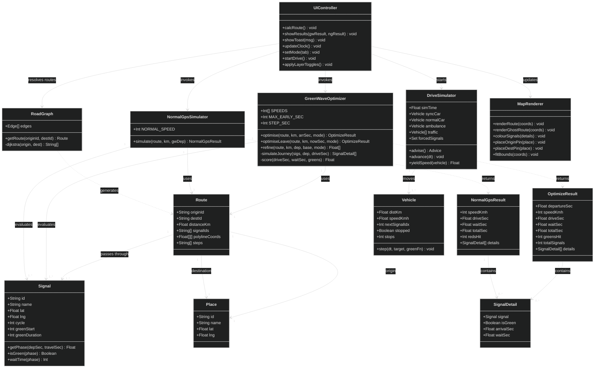

# Class Diagram — SyncDrive

```mermaid
%%{init: {"theme": "dark"}}%%
classDiagram
    class Place {
        +String id
        +String name
        +Float lat
        +Float lng
    }

    class Signal {
        +String id
        +String name
        +Float lat
        +Float lng
        +Int cycle
        +Int greenStart
        +Int greenDuration
        +getPhase(depSec, travelSec) Float
        +isGreen(phase) Boolean
        +waitTime(phase) Int
    }

    class Route {
        +String originId
        +String destId
        +Float distanceKm
        +String[] signalIds
        +Float[][] polylineCoords
        +String[] steps
    }

    class OptimizeResult {
        +Float departureSec
        +Int speedKmh
        +Float driveSec
        +Float waitSec
        +Float totalSec
        +Int greensHit
        +Int totalSignals
        +SignalDetail[] details
    }

    class SignalDetail {
        +Signal signal
        +Boolean isGreen
        +Float arrivalSec
        +Float waitSec
    }

    class NormalGpsResult {
        +Int speedKmh
        +Float driveSec
        +Float waitSec
        +Float totalSec
        +Int redsHit
        +SignalDetail[] details
    }

    class GreenWaveOptimizer {
        +Int[] SPEEDS
        +Int MAX_EARLY_SEC
        +Int STEP_SEC
        +optimise(route, km, arrSec, mode) OptimizeResult
        +optimiseLeave(route, km, nowSec, mode) OptimizeResult
        +refine(route, km, dep, base, mode) Float[]
        -simulateJourney(sigs, dep, driveSec) SignalDetail[]
        -score(driveSec, waitSec, greens) Float
    }

    class NormalGpsSimulator {
        +Int NORMAL_SPEED
        +simulate(route, km, gwDep) NormalGpsResult
    }

    class RoadGraph {
        +Edge[] edges
        +getRoute(originId, destId) Route
        -dijkstra(origin, dest) String[]
    }

    class Vehicle {
        +Float distKm
        +Float speedKmh
        +Int nextSignalIdx
        +Boolean stopped
        +Int stops
        +step(dt, target, greenFn) void
    }

    class DriveSimulator {
        +Float simTime
        +Vehicle syncCar
        +Vehicle normalCar
        +Vehicle ambulance
        +Vehicle[] traffic
        +Set forcedSignals
        +advise() Advice
        +advance(dt) void
        +yieldSpeed(vehicle) Float
    }

    class MapRenderer {
        +renderRoute(coords) void
        +renderGhostRoute(coords) void
        +colourSignals(details) void
        +placeOriginPin(place) void
        +placeDestPin(place) void
        +fitBounds(coords) void
    }

    class UIController {
        +calcRoute() void
        +showResults(gwResult, ngResult) void
        +showToast(msg) void
        +updateClock() void
        +setMode(tab) void
        +startDrive() void
        +applyLayerToggles() void
    }

    Route "1" --> "1..*" Signal : passes through
    Route "1" --> "1" Place : origin
    Route "1" --> "1" Place : destination
    GreenWaveOptimizer "1" --> "1" Route : uses
    GreenWaveOptimizer "1" --> "1..*" Signal : evaluates
    GreenWaveOptimizer ..> OptimizeResult : returns
    NormalGpsSimulator "1" --> "1" Route : uses
    NormalGpsSimulator "1" --> "1..*" Signal : evaluates
    NormalGpsSimulator ..> NormalGpsResult : returns
    OptimizeResult "1" --> "0..*" SignalDetail : contains
    NormalGpsResult "1" --> "0..*" SignalDetail : contains
    UIController --> GreenWaveOptimizer : invokes
    UIController --> NormalGpsSimulator : invokes
    UIController --> MapRenderer : updates
    UIController --> DriveSimulator : starts
    UIController --> RoadGraph : resolves routes
    DriveSimulator "1" --> "3..*" Vehicle : moves
    RoadGraph ..> Route : generates
```
